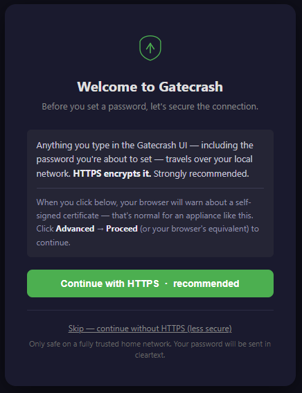
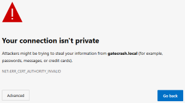
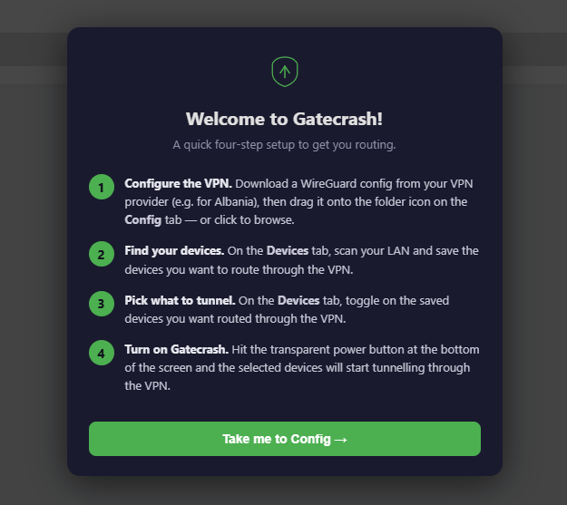

# Gatecrash

**Route specific devices on your network through a VPN — without installing
anything on them, without replacing your router, and without any inline
hardware.**

Gatecrash is a small Linux appliance that sits alongside your existing router
and uses ARP spoofing to selectively intercept traffic from chosen devices,
routing it through a WireGuard VPN tunnel. Target devices don't know anything
has changed — no apps to install, no settings to configure, no profiles to
accept. Your smart TV, games console, or streaming box just quietly gets a
different exit IP.

Can be run on a SPC (e.g. Raspberry Pi), dedicated machine, or virtual machine.

### What makes this different?

- **VPN routers** (GL.iNet, Vilfo, pfSense) can route per-device — but they
  replace your router. Gatecrash works alongside it.
- **Device VPN apps** (NordVPN, Surfshark) require software on each device.
  Smart TVs and IoT devices often can't run them at all.
- **Inline devices** (Hak5 Packet Squirrel) sit physically between a device
  and the network. Gatecrash works from anywhere on the LAN.
- **Pi-hole** has a similar "plug in a box" philosophy — but it blocks ads
  via DNS, not route traffic through a VPN.

Gatecrash needs nothing from the target device and nothing from the router.
Plug it in, point it at the devices you want, and their traffic exits from
a different country. Everything else on your network is unaffected. If the
VPN drops, target devices fall back to the normal gateway automatically.

## Quickstart — DietPi on any modern SBC

The fastest path to a working Gatecrash box is **DietPi** on a Raspberry Pi or
any DietPi-supported SBC.

DietPi has a built-in headless-install hook that runs
Gatecrash's installer on first boot, so you flash an SD card, drop in a config
file, plug it in, and walk away.

Quickstart Hardware Requirements:

* **Supported Single Board Computer** which supports Diet Pi, with Ethernet, e.g. Raspberry Pi 4. *Pi Model B is too slow*
* **SD card** 8GB or larger.  May work with 4GB, but has not been tested
* **Wired Ethernet** connection

### 1. Flash DietPi to the SD card

These instructions assume a Raspberry Pi and use the Raspberry Pi Imager. For other devices, see [How to install DietPi](https://dietpi.com/docs/install/) from the Diet Pi website.

Install [Raspberry Pi Imager](https://www.raspberrypi.com/software/), then:

1. **Choose Device** — pick your SBC
2. **Choose OS** → *Other general-purpose OS* → **DietPi** → **DietPi OS (64-bit)**
3. **Choose Storage** — your SD card


### 2. Drop the new `dietpi.txt` onto the SD card

After flashing, the SD card's boot partition will be visible on your computer
(usually a volume named `bootfs` or `boot`). Replace its `dietpi.txt` with
the one from this repo:

[dietpi.txt](dietpi.txt) — direct link:
<https://raw.githubusercontent.com/HoratioConkerhead/gatecrash/master/dietpi.txt>

Save it as `dietpi.txt` in the SD card's boot partition, overwriting the
DietPi default. Then **open it and change one line**:

``` 
AUTO_SETUP_GLOBAL_PASSWORD=<your-password>
```

This is the root + dietpi user SSH password. Pick something strong — DietPi
removes it from the file after first boot.

That's the only edit you need.

#### What this file actually changes

For transparency (and so you can re-apply the same edits to a fresh upstream
`dietpi.txt` if ours ever drifts behind DietPi's), here are the lines our
file changes from DietPi's defaults:

| Key | DietPi default | Gatecrash | Why |
|-----|----------------|-----------|-----|
| `AUTO_SETUP_GLOBAL_PASSWORD` | `dietpi` | `<your-password>` | The SSH/root password — you must set your own |
| `AUTO_SETUP_NET_HOSTNAME` | `DietPi` | `gatecrash` | So the box is reachable as `gatecrash.local` on the LAN |
| `CONFIG_SERIAL_CONSOLE_ENABLE` | `1` | `0` | Appliance is accessed via SSH / web UI, not serial |
| `AUTO_SETUP_APT_INSTALLS` | (unset) | Gatecrash dependency list | Pre-installs every package `setup.sh` needs |
| `AUTO_SETUP_AUTOMATED` | `0` | `1` | Run DietPi's first-boot unattended |
| `CONFIG_ENABLE_IPV6` | `1` | `0` | Gatecrash only intercepts IPv4 — leaving IPv6 on is a bypass route around the VPN |
| `AUTO_SETUP_CUSTOM_SCRIPT_EXEC` | `0` | `install.sh` URL | Runs Gatecrash's installer at the end of first-boot |

If you want to set your timezone, locale, or keyboard, they're near the top
of the file and well-commented.

### 3. Boot and wait

Eject the SD card, put it in the SBC, plug into ethernet, power on.

First boot does a lot: DietPi configures itself, installs the apt packages,
clones the Gatecrash repo, and runs `setup.sh`. On a modern Pi this is ~10–20
minutes. You don't need to log in.  

When the install has finished, the SD card light will be off.

### 4. Open the web UI 

On a computer or phone on the same LAN navigate to **http://gatecrash.local**

### 5. choose HTTPS or HTTP

Choose HTTPS, or skip accept warning for HTTP:



### 6. Accepts HTTPS warning and continue

If you have selected HTTPS, you'll need to accepts the browser warning



### 7. Configure Password


### 8. Configure Gatecrash
Follow the Configure steps:



1. **Configure the VPN.**  Download a WireGuard config from your VPN provider (e.g. for Albania), then drag it onto the folder icon on the **Config** tab — or click to browse.

2. **Find your devices** On the **Devices** tab, scan your LAN and save the devices you want to route through the VPN.

3. **Pick what to tunnel.** On the **Devices** tab, toggle on the saved devices you want routed through the VPN.

4. **Turn on Gatecrash.** Hit the transparent power button at the bottom of the screen and the selected devices will start tunnelling through the VPN.

### 9. Add As App and Finish!

You can add Gatecrash as an app on your phone.  Click **TO BE FINISHED**


---

### CLI commands (if preferred)

```bash
sudo /opt/gatecrash/start.sh           # start Gatecrash
sudo /opt/gatecrash/stop.sh            # stop and restore normal routing
sudo systemctl status gatecrash        # Gatecrash service status
sudo systemctl status gatecrash-webui  # web UI status
```

---

## Other platforms

Not using DietPi? Gatecrash also runs on:

- [**Raspberry Pi OS Lite**](docs/INSTALL-PIOS.md) — the standard Pi OS path
- [**Hyper-V VM on Windows**](docs/INSTALL-HYPERV.md) — Debian guest
- [**Bare-metal Debian**](docs/INSTALL-DEBIAN.md) — any small machine you've
  already put Debian on

---

## How It Works

Gatecrash spoofs ARP **in both directions** so it sits invisibly between the
target device and the real gateway. Neither end realises:

```
   ┌──────────────┐         ┌──────────────────┐         ┌──────────────┐
   │   Target     │ ◄─ARP─► │    Gatecrash     │ ◄─ARP─► │ Real Gateway │
   │ 192.168.1.90 │  spoof  │ (gatecrash.local)│  spoof  │ 192.168.1.1  │
   └──────────────┘         └────────┬─────────┘         └──────┬───────┘
                                     │                          │
                                wg0  │                          │  eth0
                                     ▼                          ▼
                              VPN Provider                  Internet
                                     │                 (Gatecrash's own
                                     ▼                  traffic, unaffected)
                                 Internet
                            (target's exit IP)
```

- **Forward spoof** (target → Gatecrash): the target sees Gatecrash's MAC
  when it ARPs for the gateway, so all its outbound traffic comes to Gatecrash.
- **Reverse spoof** (gateway → Gatecrash): the real gateway sees Gatecrash's
  MAC when it ARPs for the target, so any return traffic destined for the
  target also flows through Gatecrash. (Most return traffic for VPN-routed
  flows comes back via WireGuard, but the reverse spoof keeps the
  man-in-the-middle complete for any LAN-side packets the gateway might send
  to the target — DHCP renewals, ICMP, etc.)

The target device needs zero configuration changes. It doesn't know anything
has changed. If Gatecrash stops, both ARP caches self-correct within a couple
of minutes and traffic flows normally again.

### Device tracking

Gatecrash tracks target devices by **MAC address**, not IP address. You do not
need static DHCP reservations for your target devices — if a device gets a new
IP from DHCP, Gatecrash detects the change via the ARP table within 60 seconds
and updates its routing rules automatically.

iPhones and Android devices use **per-network randomised MACs** (the same
random MAC is reused consistently on the same network), so they are tracked
reliably without any extra configuration.

## Web UI

After setup, the web UI is available at **http://gatecrash.local**. It provides:

- **Status** — live indicators for Gatecrash and WireGuard
- **Controls** — start/stop Gatecrash and WireGuard independently
- **Device management** — scan the LAN, save devices by MAC, enable/disable per-device
- **Auto-stop** — automatically disable idle devices after configurable timeout (e.g. user stopped streaming and went to bed)
- **VPN Test** — checks your VPN exit IP through the tunnel
- **Config editor** — set target IPs, gateway, and LAN interface
- **WireGuard config** — upload/paste your VPN provider's config
- **WireGuard stats** — endpoint, last handshake, bytes transferred
- **DNS query log** — live view of DNS requests from target devices
- **Audit log** — persistent log of all service actions, auth events, config changes (Diagnostics tab)
- **Updates** — check for and apply updates from GitHub in one click
- **PWA** — install as an app on iPhone, Android, or desktop

## Auto-Stop (Idle Device Timeout)

Gatecrash automatically disables devices that have gone idle — useful for
devices left on overnight after streaming.

Disable it in **Config → Auto-Stop** in the web UI. Settings:

| Setting | Default | Description |
|---------|---------|-------------|
| Traffic threshold | 50 KB/min | Below this = "idle" (streaming is typically 5,000+ KB/min) |
| Idle timeout | 30 min | How long below threshold before disabling |
| Minimum active time | 5 min | Don't auto-stop recently enabled devices |

Individual devices can be exempted from auto-stop via the device info popup
(tap the **i** button on any saved device).

Auto-stopped devices appear as disabled in the device list. Re-enable them
to start routing again. Events are logged to the audit log.

## Auto-Start on Boot

The web UI (`gatecrash-webui`) is always enabled on boot. Gatecrash and
WireGuard themselves are state-resumed via `gatecrash-resume.service`:
whatever was running at the time of the last shutdown comes back up, so
the two services stay in sync (no "gatecrash up but WG down" surprises).

If you'd rather have it always-on regardless of last state:

```bash
sudo systemctl enable gatecrash
sudo systemctl enable wg-quick@wg0
```

## Troubleshooting

| Symptom | Cause | Fix |
|---------|-------|-----|
| `http://gatecrash.local` not reachable | avahi-daemon not running | `sudo systemctl status avahi-daemon` |
| Target loses internet completely | IP forwarding not enabled | `sysctl net.ipv4.ip_forward` should return 1 |
| Target has internet but not via VPN | vpntarget routing table empty | `ip route show table vpntarget` — re-add route if missing |
| vpntarget route disappears | WireGuard was restarted | `start.sh` restores it automatically on next start |
| ARP spoof silently fails (Hyper-V) | MAC spoofing disabled | VM Settings → Network → Advanced → Enable MAC Address Spoofing |
| TCP connections hang | MTU too high | Set `MTU = 1280` in wg0.conf, add MSS clamp iptables rule |
| DNS not resolving | DNS routed through tunnel (UDP unreliable) | Use REDIRECT to local systemd-resolved instead of DNAT to remote DNS |
| dnsmasq won't start | Port 53 conflict with systemd-resolved | Don't install dnsmasq — systemd-resolved handles port 53 |
| `tcpdump -i wg0` says "No such device" | WireGuard tunnel is down | Use Start WireGuard button in web UI, or `sudo wg-quick up wg0` |
| VM's own internet breaks | `Table = off` missing in wg0.conf | WireGuard is hijacking the default route |
| Works initially then stops | arpspoof process died | Restart Gatecrash via web UI or `sudo systemctl restart gatecrash` |
| Slow speeds | MTU too low or ISP throttling | Try increasing MTU in increments of 20 from 1280 |

## How It Fails Safely

- If the VM goes down, target devices lose internet briefly until their ARP
  cache expires (typically 1–2 minutes), then traffic routes normally via the
  real gateway
- If WireGuard goes down, marked packets have no route and are dropped — the
  target loses internet but no traffic leaks outside the tunnel
- If arpspoof stops, ARP caches self-correct and traffic bypasses the VM

## Known Issues

- **IPv6 bypass risk** — ARP spoofing only intercepts IPv4. If a target device prefers IPv6 (most modern devices do when available), its traffic goes directly to the router via NDP, completely bypassing Gatecrash. Investigate: warn in the UI if IPv6 is active on the LAN, consider NDP spoofing, or strip AAAA records from DNS responses to force IPv4

## Documentation

| Doc | Audience |
|-----|----------|
| [docs/INSTALL-PIOS.md](docs/INSTALL-PIOS.md) | Installing on Raspberry Pi OS Lite |
| [docs/INSTALL-HYPERV.md](docs/INSTALL-HYPERV.md) | Installing in a Hyper-V VM on Windows |
| [docs/INSTALL-DEBIAN.md](docs/INSTALL-DEBIAN.md) | Installing on bare-metal Debian |
| [docs/MANUAL-SETUP.md](docs/MANUAL-SETUP.md) | What `setup.sh` does under the hood — for setting up by hand |
| [docs/SUPPORT.md](docs/SUPPORT.md) | Diagnosing, maintaining, and resetting an installed appliance |

## License

MIT — see [LICENSE](LICENSE).
